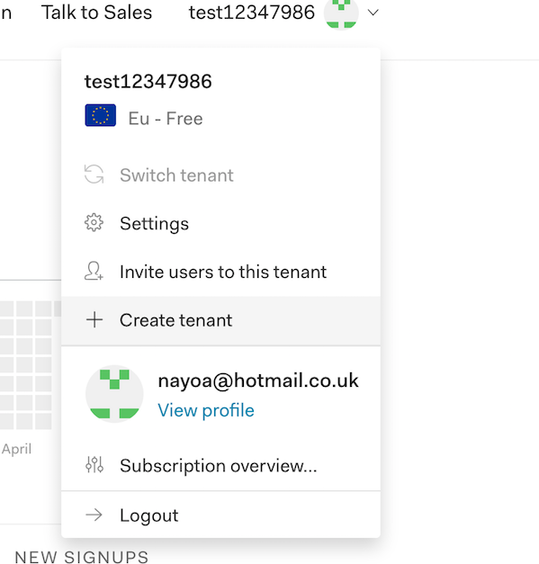
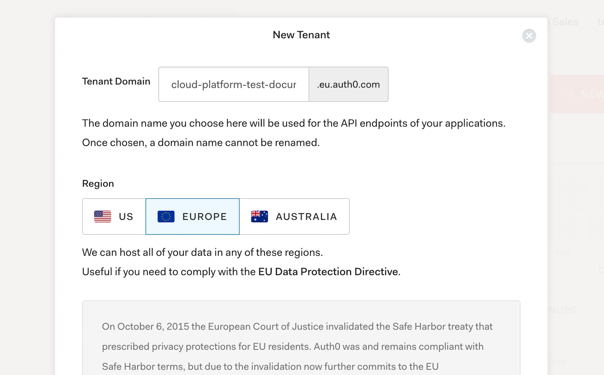

# Cluster creation using Kops

**Steps:**
1. Login to [Auth0](https://auth0.com/)

2. In the right hand corner of the dashboard, click on the dropdown and **create a new tenant**
 


3. Add a new domain name for API endpoints. 


4. Select the Region **Europe**, accept the terms and conditions and click **Create**. 

5. Create a new **"Machine to Machine"** application:

```
* Application > Create a new application > *Name the app* > Machine to Machine Applications > Create

* Select Auth0 Management API > Select all Scopes > Authorize

```

6. 
